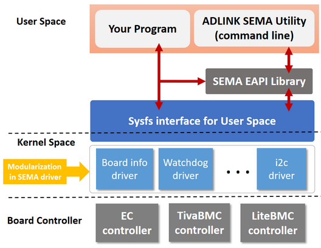

# What is SEMA?

**The Smart Embedded Management Agent (SEMA®)**

Downtime of devices or systems is not acceptable in today's industries. To help customers analyze their systems and take countermeasures for preventive maintenance, we provide a solution that can promptly monitor and collect system performance and status information from the hardware.

A Board Management Controller is embedded in our hardware and collects all relevant technical information from the chipset through different communication interfaces, such as eSPI, I2C, and SMBus.

SEMA® middleware is on top of the Board controller. It provides a ready-made application that shows the data in user-friendly graphic interfaces suitable for supervision and troubleshooting.

## 1. Architecture Overview

* Modularization implementation in SEMA drivers and each driver can be individually installed based on your needs.

* When you develop your program,  we provide two approaches to access the board controller:

  * **EAPI(Embedded API) library:**  

    PICMG® organization defined the software specification on COM Express for the industrial applications. Here is the available specification https://www.picmg.org/wp-content/uploads/COM_EAPI_R1_0.pdf for your reference.

  * **Sysfs Interface:** 

    With the exposure of Sysfs interfaces, it can be easier and straightforward to access the board controller.  

> **Note:** All of source code is free to use which including SEMA driver, EAPI library, and utility.

## 2. Features Set
SEMA® is designed to monitor and access the following features on ADLINK boards.

1. Power consumption
2. User area access
3. I2C control
4. Monitoring the temperature of the CPU and board
5. Accessing board information(Serial number, Part number, Version of the firmware)
6. Fan control
7. GPIO access for the expander(PCA9535, SX1509)
8. Watchdog

## 3. Support Operating System
* Ubuntu 18.04, 20.04, 22.04
* Yocto Linux: see sema4.0 branch of [meta-adlink-sema](https://github.com/ADLINK/meta-adlink-sema) for more details
* VxWorks (by request)
* QNX (by request)

## 4. Supported Hardware

| SEMA® - EC controller                                        | SEMA® - TivaBMC controller                                   |
| :----------------------------------------------------------- | :----------------------------------------------------------- |
| - cExpress-TL , cExpress-EL, cExpress-AR - Express-ID7, Express-ADP, Express-TL  - COM-HPC-cADP, COM-HPC-sIDH  - LEC-EL  - NanoX-EL | - Express-CF/CFE, Express-KL/KLE, Express-SL/SLE, Express-DN7, Express-BD7  - cExpress-WL, cExpress-KL, cExpress-SL, cExpress-AL - nanoX-AL - LEC-AL - Q7-AL - LEC-PX30 |

## 5. Software Documentation

- [SEMA Installation Guide for Linux](https://github.com/kkraman02/sema-linux/wiki/)
